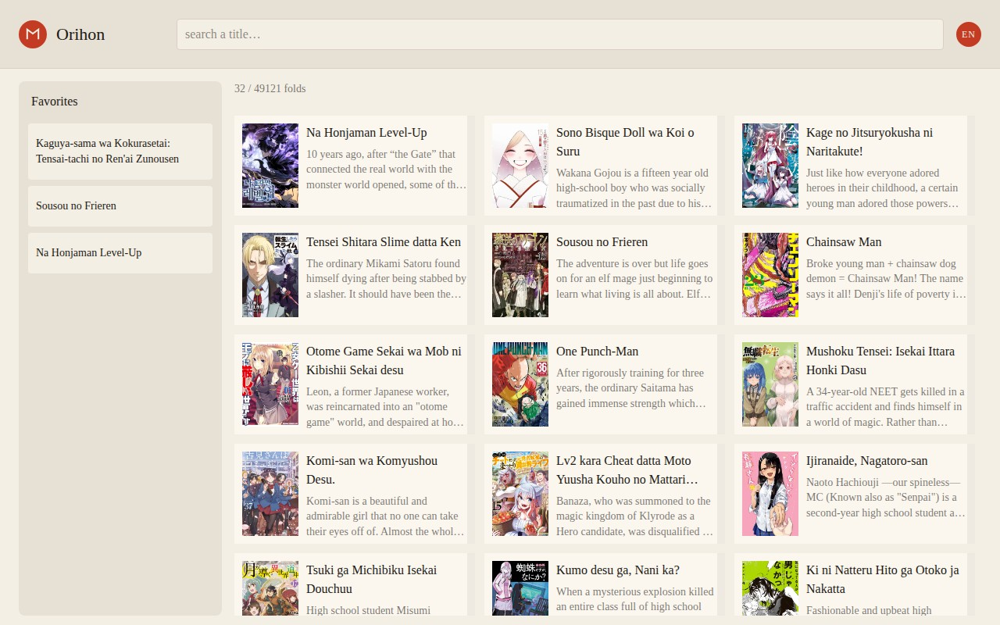

# Orihon

> Leitor desktop de mangá em **Go + Wails**, com interface **Vue, TypeScript e Inertia**.  
> Catálogo pela [MangaDex API v5](https://api.mangadex.org/docs/03-manga/search/) (oficial, grátis).  
> UI de **orihon** (livro-acordeão): estante de dobras, ficha, leitura em *spread* RTL.  
> Spec-Driven + [BMad Method](https://github.com/bmad-code-org/BMAD-METHOD).

Repositório: [silvalnk/orihon-manga-system-ui](https://github.com/silvalnk/orihon-manga-system-ui)



| | |
|--|--|
| Janela | [Wails](https://wails.io/) |
| Linguagem | Go, TypeScript |
| UI | Vue 3, Inertia, Tailwind, washi, vermelhão, dobras |
| Arquitetura | Clean Architecture no Go e na interface; MVVM na apresentação |
| Estado global | Pinia — visita em andamento. O catálogo fica em inglês |
| API | MangaDex v5 + MangaDex@Home |
| Persistência | `library.json` / `progress.json` |
| Fora de escopo | Manga Plus, paywall, Tauri, conteúdo adulto explícito |

## SDD (comece por aqui)

| Arquivo | Papel |
|---------|--------|
| [`.specify/SPEC.md`](.specify/SPEC.md) | **O quê** |
| [`.specify/PLAN.md`](.specify/PLAN.md) | **Como** |
| [`.specify/CONTEXT.md`](.specify/CONTEXT.md) | Estado atual |
| [`AGENTS.md`](AGENTS.md) | Briefing do agente |
| [`docs/GLOSSARY.md`](docs/GLOSSARY.md) | Termos para iniciante |
| [`docs/bmad/PROCESS.md`](docs/bmad/PROCESS.md) | Loop Clarify → Plan → Build → Learn |
| [`docs/adr/`](docs/adr/) | Porquês |
| [`docs/images/estante.jpg`](docs/images/estante.jpg) | Print da estante atual |
| [`LICENSE`](LICENSE) | MIT (código) |

Se código e spec divergirem, a **spec manda**.

## Pré-requisitos

- Go 1.25 (versão em `go.mod`)
- Node.js 24.21 (`.tool-versions`)
- [Wails v2](https://wails.io/docs/gettingstarted/installation) (`webkit2_41` no Ubuntu 24.04)

## Como rodar

```bash
cd orihon_manga_ui
npm install
npm test
go test . ./internal/...
wails dev
```

`wails dev` abre a janela em `http://127.0.0.1:18765` e serve o pacote de `frontend/dist`. No Ubuntu 24.04 o `wails.json` usa a tag `webkit2_41`, porque o sistema traz o WebKitGTK 4.1, e esse WebKit não completa o grafo de módulos do Vite. `wails build` gera o binário com os arquivos embutidos. O teste Go é `go test . ./internal/...` para não entrar em `frontend/node_modules`.

Na estante: digite um título e **Enter**. A grade carrega mais obras ao **rolar** (barra à direita). Clique numa dobra para a ficha. A estrela vermelha guarda na estante. Clique num capítulo para o spread. O logo **Orihon** volta à estante.

Não há botões no rodapé da home. Rodapé só onde falta navegação: **Back** na ficha; **Back / Prev / Next / Single|Double** e a página atual na leitura. O carimbo **EN** fica aceso e não troca.

| Tecla | Ação |
|-------|------|
| `/` | Foco na busca |
| Enter | Buscar |
| Esc | Voltar |
| ← → | Páginas (RTL: a da **direita** é a atual; seta direita avança) |
| D | Uma página só |
| Clique direita / esquerda | Avançar / voltar |
| EN | Idioma fixo do catálogo (`en`) |

## Arquitetura

```
orihon_manga_ui/
  main.go                              janela Wails e servidor local
  internal/domain                      obras, portas, estratégia do spread
  internal/application                 casos de uso
  internal/infrastructure              MangaDex e estante JSON
  internal/composition                 liga as peças no Go
  internal/presentation                rotas Inertia
  frontend/src/domain                  estratégia do spread e dobras
  frontend/src/application             casos de uso da tela
  frontend/src/infrastructure          adaptador Inertia, Zod, sessão Pinia
  frontend/src/composition             wire.ts
  frontend/src/presentation            páginas, viewmodels, componentes
```

A interface não chama a MangaDex. O HTTP fica no adaptador Go. O Inertia é o roteador das páginas `Shelf`, `Work` e `Reader`. Favoritos e progresso ficam em `ORIHON_DATA_DIR` ou `~/.local/share/orihon/`. O visual é Tailwind (washi `#f4efe4`, vermelhão `#c23b22`).

## Licença

MIT para o **código** do Orihon. Ver [`LICENSE`](LICENSE).

As obras pertencem aos autores/editoras listados na MangaDex. O Orihon só consome a API pública. Não redistribua páginas.
